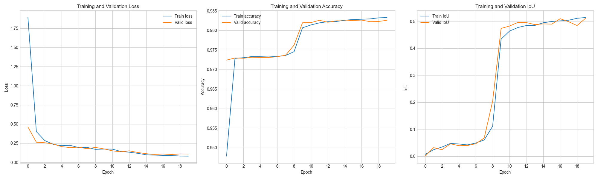

# Phát hiện Làn đường với ENet-LaneNet trên bộ dữ liệu TuSimple

Dự án này triển khai một mô hình học sâu để phát hiện làn đường trong ảnh, dựa trên kiến trúc [LaneNet](https://arxiv.org/pdf/1802.05591). Mô hình được xây dựng bằng PyTorch, sử dụng [ENet](https://arxiv.org/pdf/1606.02147) làm kiến trúc nền (backbone) để đảm bảo hiệu quả tính toán. Mục tiêu là thực hiện phân vùng thực thể (instance segmentation) để không chỉ xác định các pixel thuộc về làn đường mà còn phân biệt được các làn đường khác nhau.

Mô hình được huấn luyện trên bộ dữ liệu [TuSimple](https://www.kaggle.com/datasets/manideep1108/tusimple?select=TUSimple).

## 1. Cơ sở lý thuyết

### 1.1 Kiến trúc LaneNet

LaneNet giải quyết bài toán phát hiện làn đường bằng cách chia thành hai nhiệm vụ nhỏ hơn, được xử lý song song qua một kiến trúc hai nhánh:

#### 🔹 Nhánh Phân vùng Nhị phân (Binary Segmentation Branch)

- **Nhiệm vụ:** Trả lời câu hỏi *"Pixel này có thuộc về một làn đường hay không?"*  
- **Bản chất:** Bài toán phân loại mỗi pixel thành hai lớp: `lane` và `background`.  
- **Đầu ra:** Một bản đồ phân vùng (segmentation map) nơi các pixel thuộc làn đường được đánh dấu.  
- **Hàm mất mát:** `CrossEntropyLoss` được sử dụng để đo lường sai khác giữa dự đoán và nhãn thật.

#### 🔹 Nhánh Nhúng Đặc trưng (Instance Embedding Branch)

- **Nhiệm vụ:** Trả lời câu hỏi *"Pixel này thuộc về làn đường cụ thể nào?"*  
- **Cách hoạt động:** Nhánh này học cách ánh xạ mỗi pixel vào một không gian đặc trưng nhiều chiều (embedding space).  
- **Nguyên tắc:**  
  - Pixel thuộc **cùng một làn đường** → vector embedding gần nhau.  
  - Pixel thuộc **làn đường khác nhau** → vector embedding cách xa nhau.  

---

### 1.2 Hậu xử lý (Post-processing)

Sau khi mô hình sinh ra hai đầu ra từ hai nhánh, cần một bước hậu xử lý để nhóm các pixel thành các làn đường hoàn chỉnh.

- **Phương pháp sử dụng trong project:**  
  Thuật toán phân cụm **DBSCAN** được sử dụng để nhóm các vector embedding (của những pixel được phân loại là lane) lại với nhau.  
  Mỗi cụm kết quả tương ứng với một làn đường được phát hiện.

- **So sánh với paper gốc:**  
  Trong bài báo gốc của LaneNet, một mạng neuron thứ hai là **H-Net** được sử dụng để học phép biến đổi phối cảnh và khớp các pixel thành đường cong bậc 3 (3rd-order polynomial fit).
## 2. Dữ liệu và Tiền xử lý

### 2.1 Bộ dữ liệu TuSimple

Dự án sử dụng bộ dữ liệu từ **TuSimple Lane Detection Challenge**.

- **Quy mô:**  
  - Tổng cộng: `3626` video clip  
  - Mỗi clip có 20 khung hình tuần tự  
  - Chỉ khung hình cuối (frame thứ 20) được gán nhãn

- **Cấu trúc thư mục:**  
  - Thư mục `clips/`: Chứa các khung hình video  
  - File `label_data_*.json`: Chứa thông tin nhãn cho ảnh

- **Định dạng nhãn (JSON):** Mỗi dòng tương ứng với một ảnh, gồm:
  - `raw_file`: Đường dẫn tới file ảnh
  - `lanes`: Danh sách các tọa độ `x` của các điểm trên làn đường
  - `h_samples`: Danh sách các tọa độ `y` tương ứng với các điểm trong `lanes`
  - **Lưu ý:** Nếu giá trị `x = -2` thì tại `y` tương ứng không có điểm nào trên làn đường

---

### 2.2 Quy trình Tiền xử lý

Quy trình tiền xử lý được thực hiện trong lớp `LaneDataset`. Gồm các bước sau:

#### 🔹 Đọc và xử lý nhãn

- Đọc các file JSON
- Kết hợp `lanes` và `h_samples` để tạo danh sách tọa độ `(x, y)` cho từng làn đường
- Bỏ qua các điểm không hợp lệ (có `x = -2`)

#### 🔹 Tạo ảnh nhãn (Ground Truth)

Từ tọa độ các làn đường, tạo ra 2 loại ảnh nhãn:

- **Ảnh phân vùng nhị phân:**  
  - Vẽ tất cả các làn đường lên ảnh đen  
  - Gán cùng một giá trị (thường là `1`)  
  - Dùng cho nhánh **segmentation**

- **Ảnh phân vùng thực thể (instance):**  
  - Mỗi làn đường được gán một nhãn riêng biệt (`1, 2, 3,...`)  
  - Dùng cho nhánh **embedding**

#### 🔹 Biến đổi ảnh

- Ảnh đầu vào được chuyển sang ảnh **grayscale**
- Tất cả ảnh đầu vào và nhãn được resize về kích thước **`512x256` pixels** để đưa vào mô hình

## 3. Huấn luyện Mô hình

### Cấu hình Huấn luyện

Các tham số huấn luyện được thiết lập trong `train.py` và tham khảo từ paper gốc:

| Tham số             | Cài đặt                      |
|---------------------|------------------------------|
| Mô hình             | ENet (2 nhánh)               |
| Kích thước ảnh      | 512×256                      |
| Kích thước nhúng    | 4                            |
| Optimizer           | Adam                         |
| Learning Rate       | 5e-4                         |
| Batch Size          | 4 *(do giới hạn phần cứng)*  |
| Tỷ lệ Train/Val     | 80% / 20%                    |
| Loss Function       | CrossEntropyLoss + DiscriminativeLoss |

---

## 4. Kết quả 

Mô hình được huấn luyện trong **20 epochs**, và hiệu năng được trực quan hóa qua các biểu đồ thể hiện sự thay đổi của:

- Loss (Train / Validation)  
- Accuracy (Train / Validation)  
- IoU (Train / Validation)

#### 📈 Biểu đồ huấn luyện:

> `

---

#### 🔍 Phân tích:

##### ▸ **Hàm mất mát (Loss)**

- Cả `train loss` và `validation loss` đều giảm rõ rệt và hội tụ tốt sau 20 epochs.
- Trong 5 epochs đầu, loss giảm rất mạnh → mô hình học được nhanh chóng các đặc trưng cơ bản.
- Đường `validation loss` bám sát `train loss` → **không có hiện tượng overfitting** rõ ràng.

##### ▸ **Độ chính xác (Accuracy) và IoU**

- Accuracy tăng vọt trong 2–3 epochs đầu tiên, sau đó tiếp tục cải thiện ổn định.
- IoU có bước **nhảy mạnh từ epoch 6 đến 10**, từ khoảng `0.1` lên gần `0.5`, thể hiện mô hình bắt đầu học được các đặc trưng cốt lõi để phân biệt làn đường.
- Các đường cong validation tiếp tục **bám sát train**, cho thấy mô hình **tổng quát hóa tốt**.

---
> `

